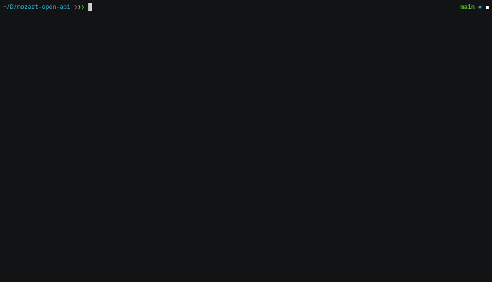

# Mozart Open API

The Mozart API is a auto-generated REST API with async capabilities and WebSocket notification channel for immediate state information.

## Installation

The Mozart Open API can be installed with pip. For more information about required Python version, check the PyPI page.

Install using pip:

__NOT WORKING__

```terminal
pip3 install mozart-api
```

## Example CLI program

The CLI program carries out one command and then exits afterwards. This and the fact that the serial number is used to specify devices sometimes results in slow MDNS discovery times.

### Usage example



### verbose

Add as option to add verbose output.

```terminal
python mozart_cli.py serial_number command command_args -v

python mozart_cli.py serial_number command command_args --verbose
```

### timeout

Add as option with parameter to modify MDNS discovery timeout.

Optionally use '-1' to have a user-interrupted device discovery:

```terminal
python mozart_cli.py serial_number command command_args -t 20

python mozart_cli.py serial_number command command_args --timeout 20

python mozart_cli.py serial_number command command_args --timeout -1
```

### websocket

Add as option to show websocket notifications before and after command execution.

Upon connection the overall state of the device will be immediately transferred.

```terminal
python mozart_cli.py serial_number command command_args -w

python mozart_cli.py serial_number command command_args --websocket
```

### remote

Add as option to show remote control websocket notifications.

```terminal
python mozart_cli.py serial_number command command_args -r

python mozart_cli.py serial_number command command_args --remote
```

### discover

Discover Mozart devices on the network.

```terminal
python mozart_cli.py discover
```

### serial number

Ensure that the serial number is reachable on the network.

```terminal
python mozart_cli.py 12345678
```

### preset

```terminal
python mozart_cli.py 12345678 preset 1
```

Will activate preset 1

### play

```terminal
python mozart_cli.py 12345678 play
```

Will activate the _play_ playback command.

### pause

```terminal
python mozart_cli.py 12345678 pause
```

Will activate the _pause_ playback command.

### next

```terminal
python mozart_cli.py 12345678 next
```

Will activate the _next_ playback command.

### previous

```terminal
python mozart_cli.py 12345678 previous
```

Will activate the _previous_ playback command.

### mute

```terminal
python mozart_cli.py 12345678 mute
```

Will mute the device.

### unmute

```terminal
python mozart_cli.py 12345678 unmute
```

Will unmute the device.

### volume

```terminal
python mozart_cli.py 12345678 volume 50
```

Will modify the volume level on the device (0-100).

### join

Will join a Beolink experience if available or will join a specific Beolink experience if available.

```terminal
python mozart_cli.py 12345678 join

python mozart_cli.py 12345678 join 23456789
```

### reset

```terminal
python mozart_cli.py 12345678 reset
```

Will factory reset a Mozart device.

### info

```terminal
python mozart_cli.py 12345678 info
```

Will print device information.

### standby

```terminal
python mozart_cli.py 12345678 standby
```

Will set a Mozart device to networkStandby.

### allstandby

```terminal
python mozart_cli.py 12345678 allstandby
```

Will set all connected Beolink devices to networkStandby.
